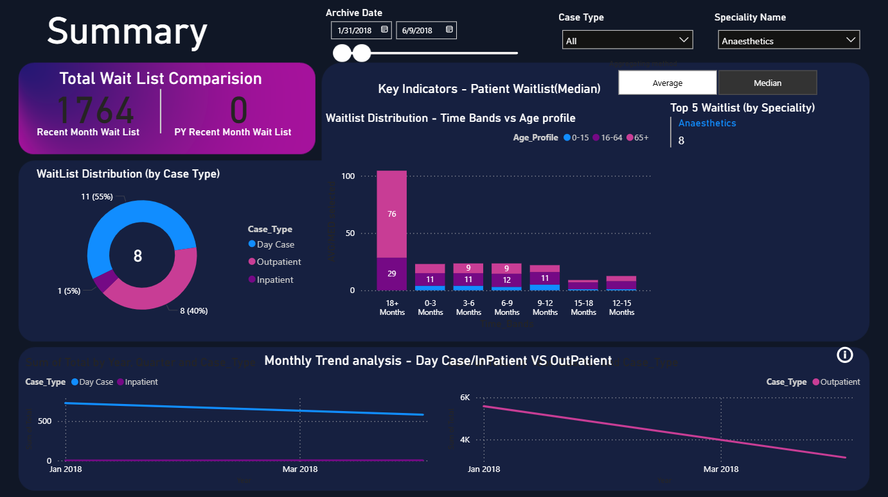
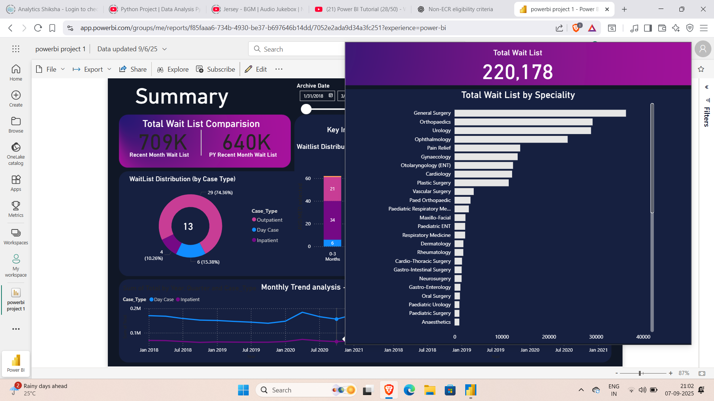
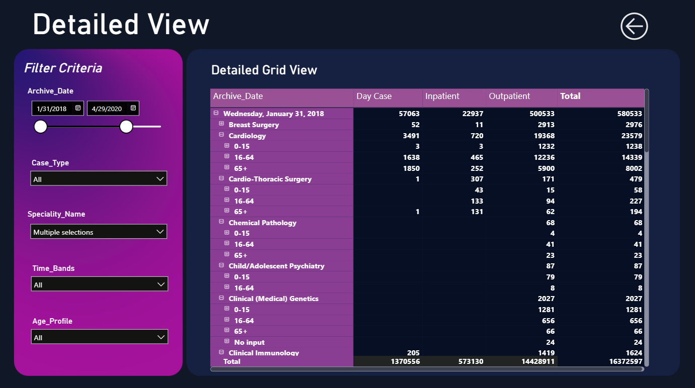

# 📊 Power BI Project: Patient Waitlist Analysis  

## 📌 Project Overview  
This project focuses on analyzing **Patient Waitlists** across different medical specialities, case types, and time bands. The dashboards provide interactive insights into patient wait times, distributions, and trends over time, enabling healthcare organizations to optimize resource allocation and improve patient care.  

The dataset is visualized in **Power BI** to generate meaningful reports and dashboards with filtering and drill-down capabilities.  

---

## 🚀 Key Features  
- **Total Wait List Comparison**  
  - Compare recent month waitlists with previous year’s month waitlists.  

- **Waitlist Distribution (by Case Type)**  
  - Breakdown of **Day Case, Outpatient, and Inpatient** cases.  

- **Waitlist Distribution (Time Bands vs Age Profile)**  
  - Visualize patient waitlists segmented by **time bands** (0-3 months, 6-9 months, 18+ months, etc.) and **age profiles** (0–15, 16–64, 65+).  

- **Top 5 Specialities by Waitlist**  
  - Identify the specialities with the highest waitlist numbers.  

- **Monthly Trend Analysis**  
  - Track changes in Day Case, Inpatient, and Outpatient waitlists over time.  

- **Detailed Grid View**  
  - Drill-down functionality with filters:  
    - Archive Date  
    - Case Type  
    - Speciality Name  
    - Time Bands  
    - Age Profile  

---

## 📂 Project Structure  
- **Dashboards**: Interactive Power BI dashboards (screenshots included in repository).  
- **Detailed View**: Tabular drill-down report with filters.  
- **Visuals**:  
  - Pie Charts  
  - Bar Charts  
  - Line Graphs  
  - Drill-down Table  

---

## 📸 Dashboard Previews  

### 🔹 Summary Dashboard  
  

### 🔹 Waitlist by Speciality  
  

### 🔹 Detailed Grid View  
  

---

## 🌐 Live Dashboard  

Click below to explore the **interactive live dashboard** hosted on Power BI:  

[**🔗 View the Patient Waitlist Dashboard**](https://app.powerbi.com/links/YKkp5-54cs?ctid=4ce8fa72-23e2-4b0c-b5e0-847fff441edd&pbi_source=linkShare&bookmarkGuid=25090f3e-e5a5-4380-bcb5-3ff76594ca88)  

---

## 🛠️ Tools & Technologies  
- **Power BI Desktop** – Report & Dashboard Creation  
- **Power BI Service** – Collaboration & Sharing  
- **Data Modeling** – Transformations & DAX Calculations  

---

## 🎯 Insights Gained  
- High concentration of waitlists in **18+ months band**.  
- Majority of cases are **Outpatient**.  
- Certain specialities like **General Surgery & Orthopaedics** have the highest waitlists.  
- Trends indicate fluctuations in **Day Case and Inpatient** waitlists compared to **Outpatient**.  

---

## 📌 How to Use  
1. Clone this repository.  
2. Open the `.pbix` file in **Power BI Desktop**.  
3. Use available slicers (filters) to explore:  
   - Date ranges  
   - Case types  
   - Specialities  
   - Age profiles  

---

## 🤝 Contribution  
Feel free to fork this repo, raise issues, or submit pull requests to improve the dashboard design and features.  

---

## 📧 Contact  
👤 **Dasappagari Sai Kiran Reddy**  
📩 Email: [dasappagarisaikiranreddy@gmail.com](mailto:dasappagarisaikiranreddy@gmail.com)  
